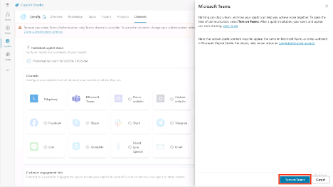

# @lab.Title

In this lab you’ll work with Microsoft Copilot Studio to build your first agent using Generative answers, you’ll then publish this agent to Microsoft Teams.

In the second half of this workshop, you'll extend your agent with a custom connector that you’ll build in Visual Studio, publish this as custom connector and then add this as an action to your agent.

The green text with the +++icon+++ can be clicked on and will be typed automatically into the VM, For example, please click in the password text box and then click the password: +++@lab.VirtualMachine(WRK530).Password+++

> [!note] To ensure text is entered accurately avoid interacting or clicking in the VM until the text has finished being typed

===

!INSTRUCTIONS [1 - Build Your First Agent](https://raw.githubusercontent.com/microsoft/aitour-building-copilots-with-copilot-studio/refs/heads/main/lab/lab-default/01-Build-Your-First-Agent.md)

===

# 2 - Publishing Your Agent

Now that you have confirmed your agent is working as expected let’s publish the agent. This allows you to then use your agent in other channels like embedding on your public website or using inside of Microsoft Teams

1. Click the **Publish** button in the top right-hand corner
 
    

1. Click the **Publish** button to publish your agent
 
    
 
    The following dialog will be displayed you can close this and your agent will finish publishing in the background
 
    
1. Now that it’s published, we need to make this available to use within Microsoft Teams. Select the **Channels** tab in the top menu
 
   
1. Under the list of channels, select **Microsoft Teams**

 
1. In the panel that opens on the right-hand side, select **Turn on Teams**
 
    
1. After Teams is turned on, you’ll get a message letting you know the channel was added. Select **Open agent** to add your new agent to Teams
 
   .
1. Choose **Use the web app instead**
 
    
1. You’ll see a preview of your agent. Select **Add**
 
   
24. Your agent is now added and accessible in Microsoft Teams. Test your agent by asking +++What are the specs for the latest Surface laptop?+++ in the prompt input and press Enter
 

Congratulations! You’ve now built and published an agent to Microsoft Teams!

===

!INSTRUCTIONS [3 - Extending Agent With Custom Connectors](https://raw.githubusercontent.com/microsoft/aitour-building-copilots-with-copilot-studio/refs/heads/main/lab/lab-default/03-Extending-Agent-With-Custom-Connectors.md)

===

!INSTRUCTIONS [4 - Add a New Method To The Connector](https://raw.githubusercontent.com/microsoft/aitour-building-copilots-with-copilot-studio/refs/heads/main/lab/lab-default/04-Add-A-New-Method-To-The-Connector.md)

===

!INSTRUCTIONS [5 - Adding Connector To Microsoft Copilot Studio](https://raw.githubusercontent.com/microsoft/aitour-building-copilots-with-copilot-studio/refs/heads/main/lab/lab-default/05-Adding-Connector-To-Microsoft-Copilot-Studio.md)

===

!INSTRUCTIONS [6 - Adding the Contoso Plugin to your Agent](https://raw.githubusercontent.com/microsoft/aitour-building-copilots-with-copilot-studio/refs/heads/main/lab/lab-default/06-Adding-The-Contoso-Plugin-To-Your-Agent.md)
