# 6 - Adding the Contoso Plugin to your Agent

1. Reopen the **Microsoft Edge** window from the start of the lab and click on the Copilot Studio tab

1. Click on the **Settings** button on the right of the top nav bar

    

1. Click on **Generative AI** in the left navigation

    

1. Confirm that the **Generative** option is selected then click **Save**

    

1. Click on **Close (x)** button to close out of settings and get back to your agent

1. Click on the **Actions** option in the top nav

    

1. Click the **+ Add an action** button to add a new action

    

1. Enter **Contoso** in the search field and hit **Enter**

    

1. Click **Get Order Details** to begin adding this action to your agent

    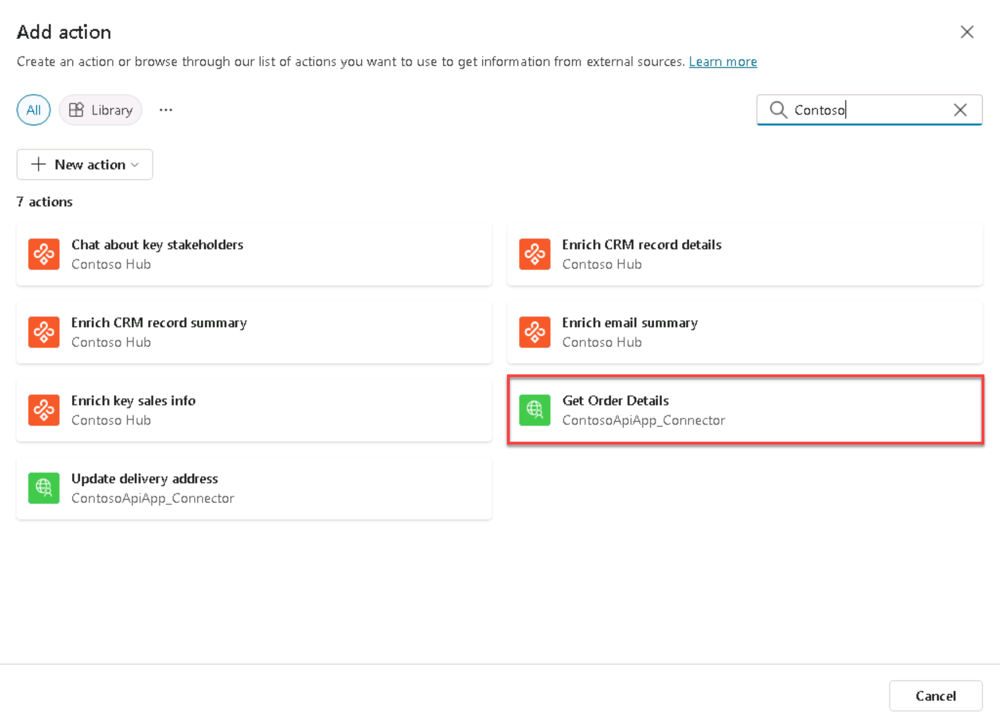

1. Once the connection has loaded, select **Next**

    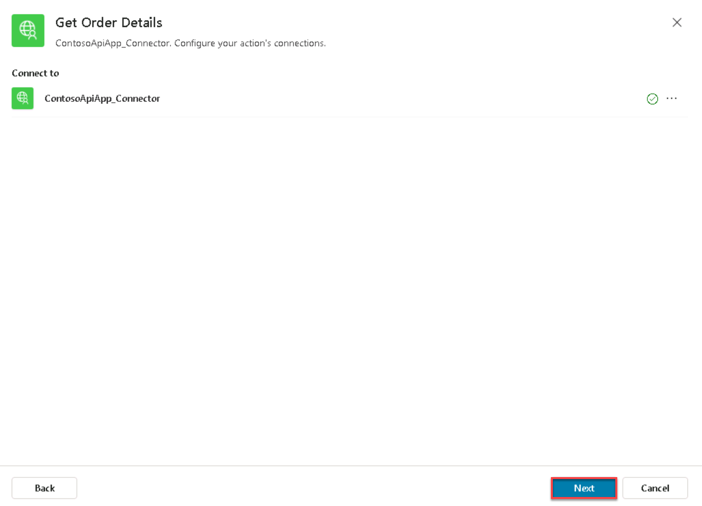

1. Select the End user authentication dropdown and select **Copilot author authentication**, then click **Add action**

    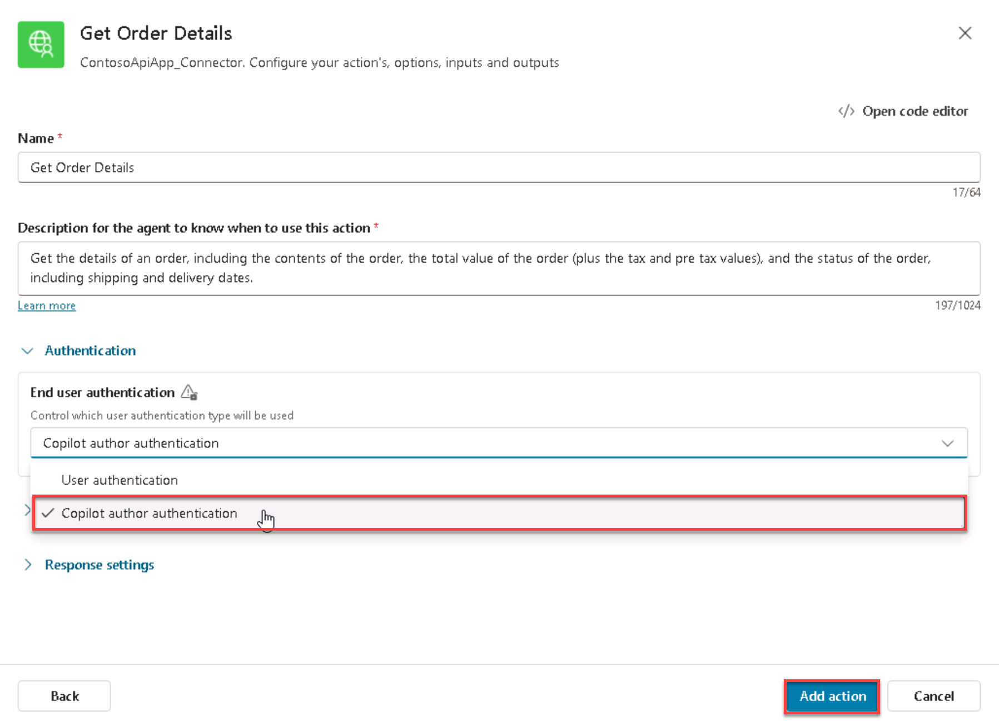

1. On the next screen, select **Add Action** to add the other action from our connector.

    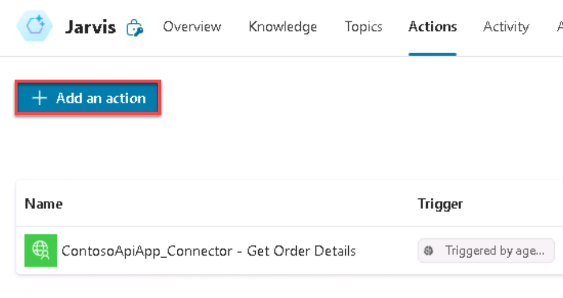

1. Enter **Contoso** in the search field and hit **Enter**

    

1. You may have to scroll down in the list of connectors to find your results again. Click **Update Delivery Address** to begin adding this action to your agent

    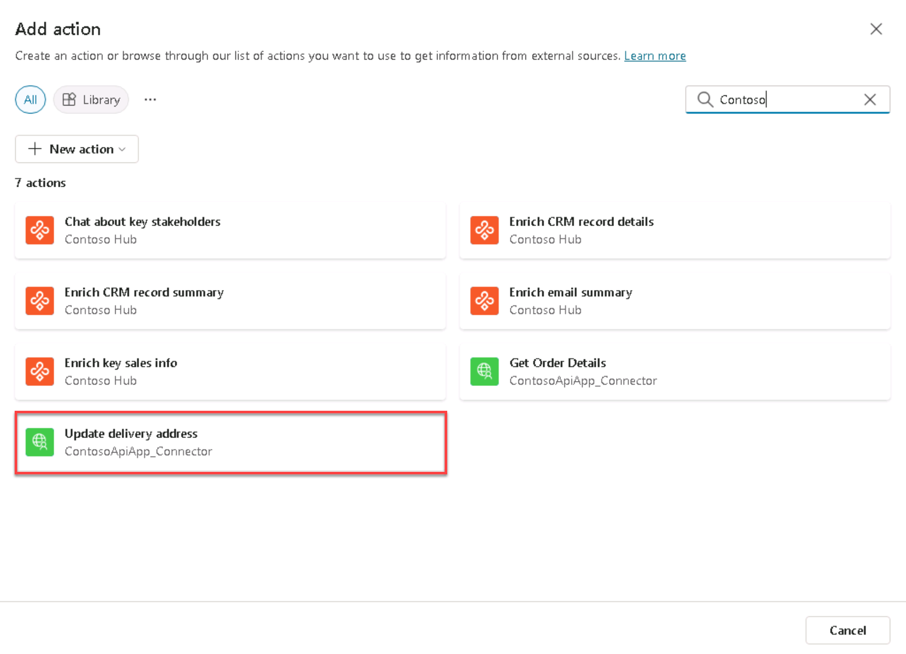

1. Once the connection has loaded, select **Next**

    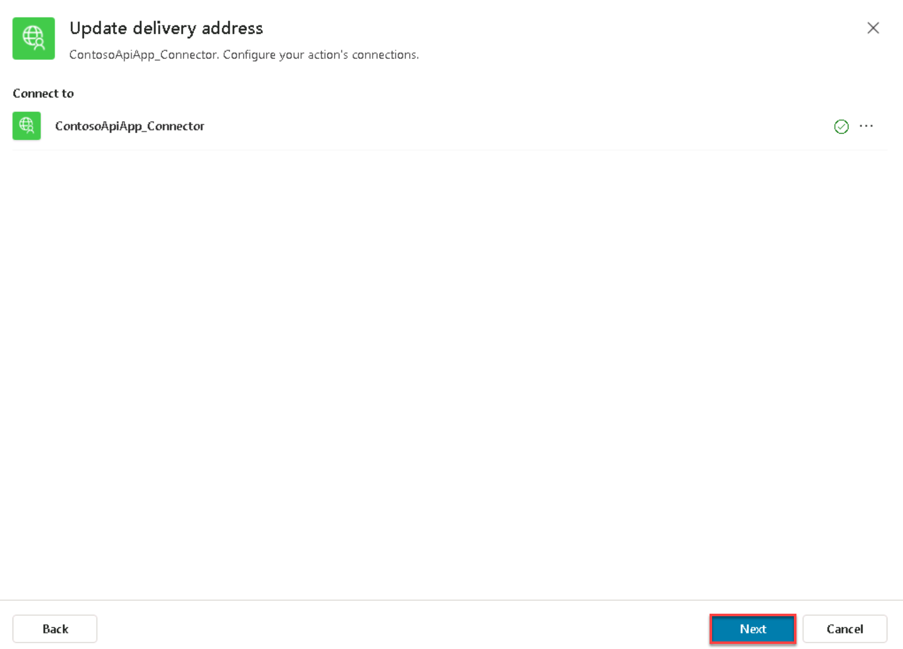

1. Select the End user authentication dropdown and select **Copilot author authentication**, then click **Add action**

    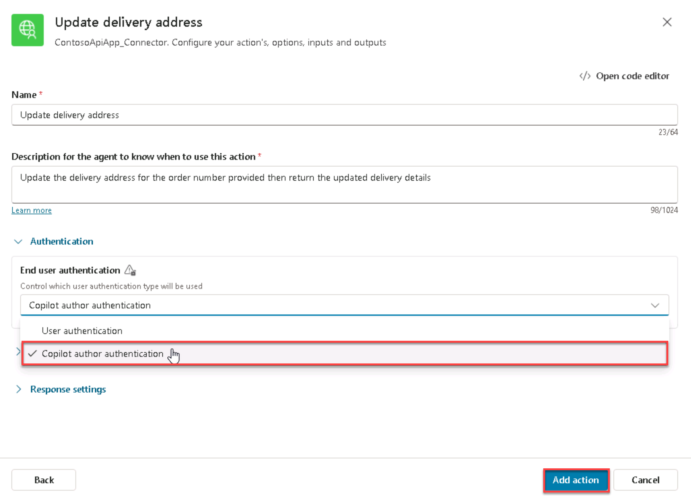

1. Confirm that you see both the **Get order details** and **Update delivery address** actions in the list of items on the Actions screen

    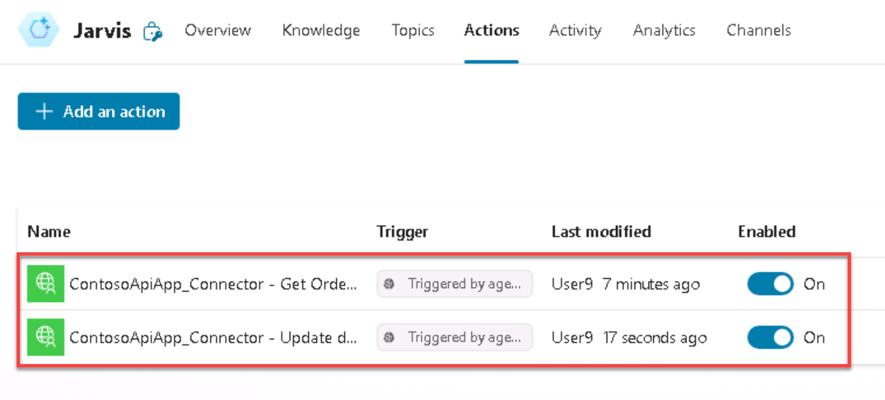

1. Return to Visual Studio and click the **Run** button next to the HTTPS flag to run your application in HTTPS

    

1. Click **Yes** on the **Microsoft Visual Studio** dialog to trust the IIS Express SSL certificate.

    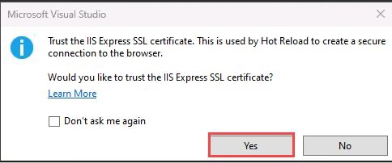

1. Click **Yes** on the final security warning dialog to install the IIS cert

    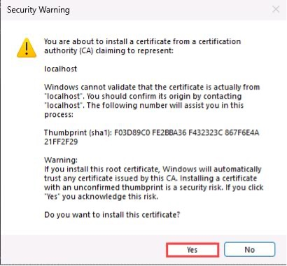

1. Once the application is running a new browser window will open with a warning that you are about to connect to a developer tunnel click **Continue** to open your running application in Microsoft edge

    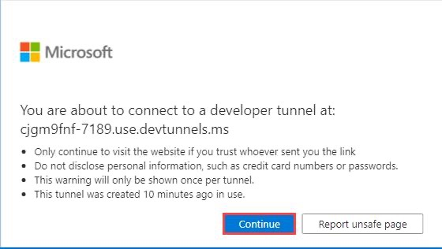

1. With your application running return to Microsoft Copilot Studio in the **Test Copilot** pane click the Map button on the right to open the conversation map console

    

1. Now you can test your Copilot's new capabilities and see in real time how it is making calls to the plugins you just added. Enter +++What's my order details?+++ and click **send**

    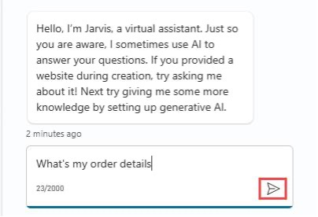

1. An **Activity Map** pane should pop up. This is where you can see how your agent is pulling together the actions needed to complete your request. However, as you have not provided an order number to make the call to the service it has formulated a response to ask you for the missing details

    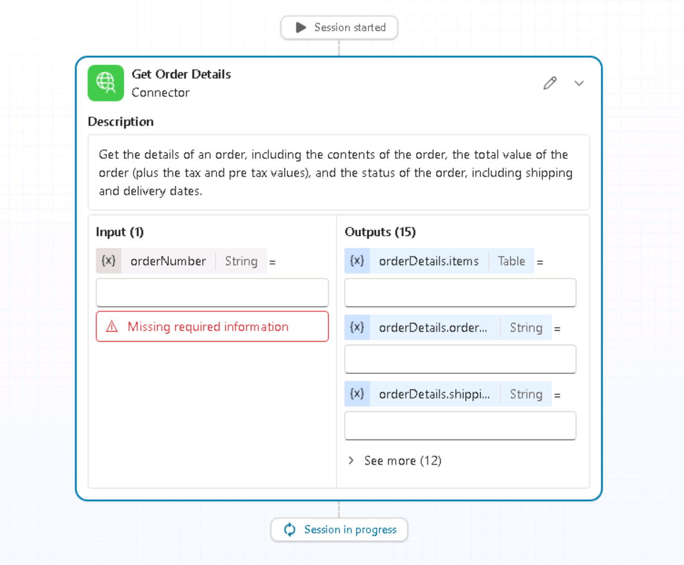

1. Enter an order number and click **send**

    

    You'll see the order number is passed to the actions and the results are returned to your agent

    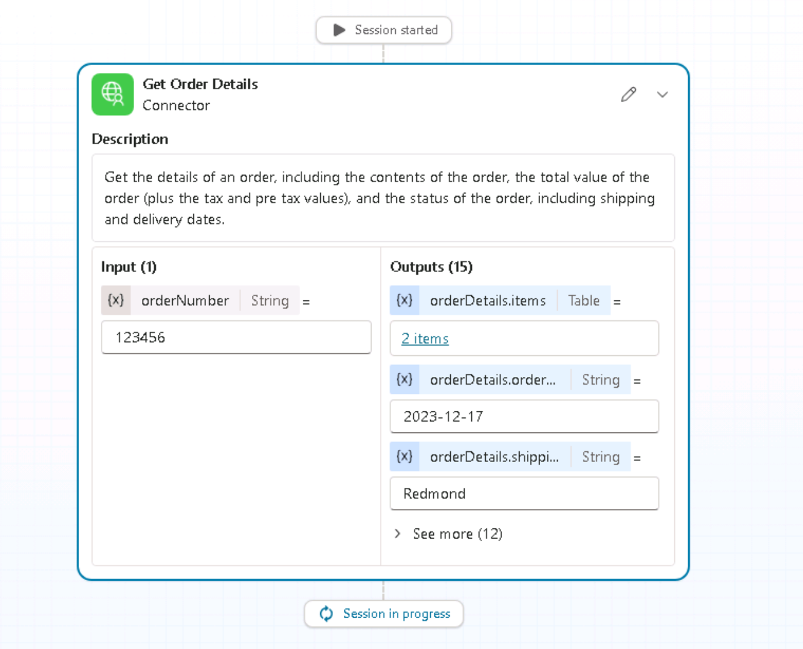

1. Click the reset button to start a new test session

    

1. Enter +++Update my delivery address for order 123456 to 1 Microsoft Way, Redmond 98052 WA+++ and click send

    

1. This time Copilot Studio will find the right action and it will be smart enough to fill all the address details in the right inputs as shown below

    

Congratulations! That's it! You have successfully created a new agent and extended that using a custom connector! 

Nothing will be graded so feel free to submit and close out of the VM. If you finished the workshop you get an A+!
